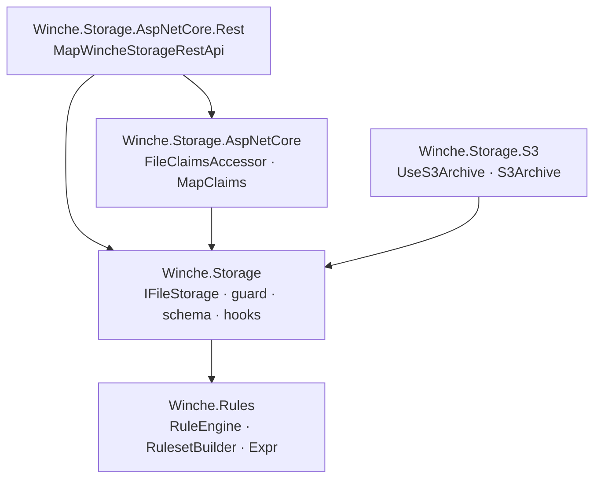
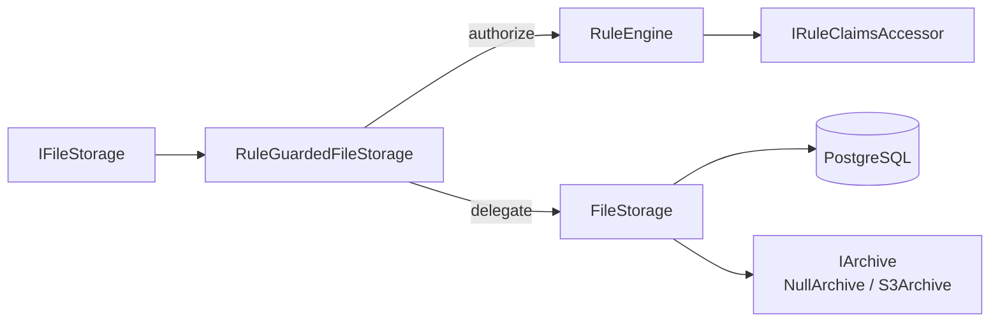
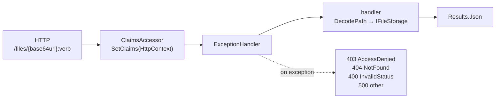
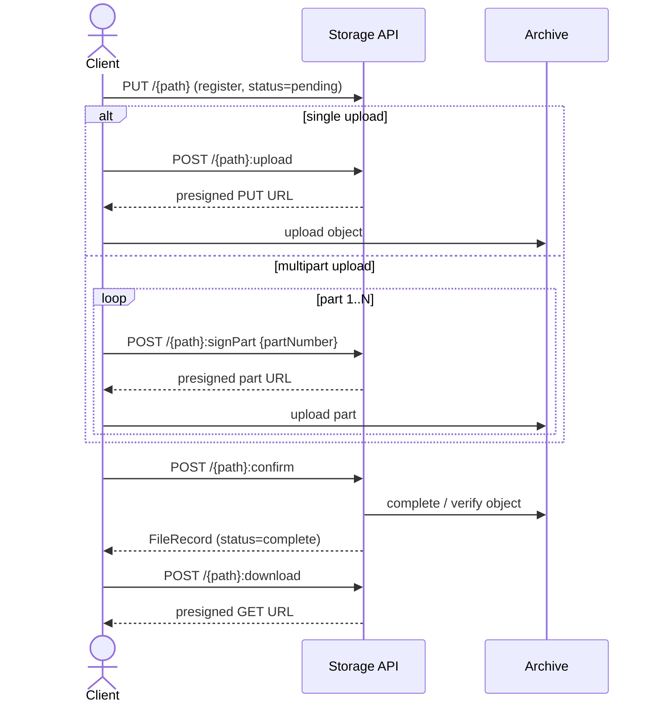
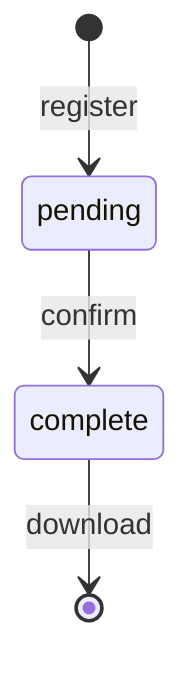
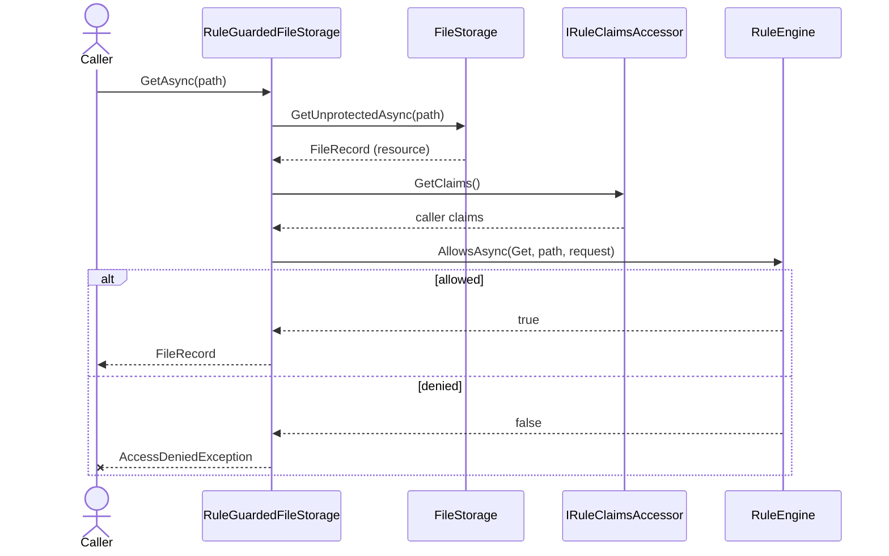

# Winche.Storage

Lightweight .NET libraries for storing file metadata in PostgreSQL and objects in S3-compatible archives via presigned URLs. The solution includes core abstractions, an S3 archive provider, an ASP.NET Core base + REST adapter, and a sample app.

Access control is enforced with [Winche.Rules](https://github.com/FlameOfUdun/winche-rules) — the same Firestore-style rules engine used by `Winche.Database`.

## Packages

| Package | Description |
| --- | --- |
| `Winche.Storage` | Core: schema management, file CRUD, hooks, Winche.Rules guard |
| `Winche.Storage.S3` | S3-compatible archive provider (presigned URLs, multipart upload) |
| `Winche.Storage.AspNetCore` | ASP.NET Core base: HTTP-context claims mapping (`MapClaims`) |
| `Winche.Storage.AspNetCore.Rest` | Minimal-API REST endpoints (depends on the base package) |

## Architecture

Package dependencies:



Runtime components inside the core. The public `IFileStorage` is the rules guard; it authorizes
through the `RuleEngine`, then delegates to the unprotected `FileStorage`, which talks to Postgres
and the pluggable archive:



## Install

```cmd
dotnet add package Winche.Storage
dotnet add package Winche.Storage.S3
dotnet add package Winche.Storage.AspNetCore.Rest
```

## Quick Start

### 1. Configure `appsettings.json`

```json
{
  "ConnectionStrings": {
    "WincheStorage": "Host=localhost;Database=mydb;Username=user;Password=pass"
  },
  "WincheStorage:S3Archive": {
    "BucketName": "your-bucket",
    "RegionName": "us-east-1",
    "AccessKey": "YOUR_ACCESS_KEY",
    "SecretKey": "YOUR_SECRET_KEY",
    "PresignedUrlExpiry": "00:15:00"
  }
}
```

`AccessKey` and `SecretKey` are optional. Omit them when deploying to AWS with a task role or instance profile — the SDK uses ambient IAM credentials automatically.

For a non-`public` schema, add `Search Path=myschema` to the connection string (the metadata table is created in the connection's `search_path`).

### 2. Register services

```csharp
using Winche.Rules;
using Winche.Rules.Expressions;
using Winche.Storage.AspNetCore.DependencyInjection;       // MapClaims
using Winche.Storage.DependencyInjection;                  // AddWincheStorage
using Winche.Storage.S3.DependencyInjection;               // UseS3Archive

builder.Services.AddWincheStorage(opts =>
{
    opts.ConnectionString = builder.Configuration.GetConnectionString("WincheStorage");

    // Default-deny. Grant access with one or more rule blocks.
    opts.UseRules(r => r.Match("userFiles/{userId}/{rest=**}", owned =>
        owned.Allow(RuleOperations.All, Expr.Auth("token", "userId").Eq(Expr.Param("userId")))));

    opts.UseS3Archive(s3 => builder.Configuration.GetSection("WincheStorage:S3Archive").Bind(s3));

    // Map HTTP requests to caller claims consumed by the rules engine.
    opts.MapClaims(ctx => new Dictionary<string, object?>
    {
        ["userId"] = ctx.Request.Headers["X-USER-ID"].ToString(),
    });
});
```

### 3. Initialize schema and map endpoints

```csharp
await app.InitializeWincheStorageAsync();   // creates the winche_files table if it doesn't exist
app.MapWincheStorageRestApi();              // maps REST routes under the "files/" prefix
```

See [samples/Winche.Storage.Sample](samples/Winche.Storage.Sample) for a complete working example.

## Configuration

### `AddWincheStorage`

A single overload takes an `Action<WincheStorageOptions>`. Set the connection string and register
components inside the lambda:

```csharp
services.AddWincheStorage(opts =>
{
    opts.ConnectionString = "Host=...;Database=...;Username=...;Password=...";
    opts.UseRules(/* ... */);
    opts.UseHooks(h => h.Add<AuditHook>("userFiles/{userId}/{file=**}"));
    opts.UseS3Archive(/* Action<S3ArchiveOptions> */);
    opts.MapClaims(/* Func<HttpContext, IReadOnlyDictionary<string, object?>?> */);
});
```

### `WincheStorageOptions`

| Member | Description |
| --- | --- |
| `ConnectionString` | _(required)_ Postgres connection string. Schema comes from its `Search Path`. |
| `UseRules(...)` | Adds a `RuleSet` to the guard. Multiple calls accumulate (OR-combined). |
| `UseHooks(h => h.Add<T>(path))` | Registers `FileStoreHook` lifecycle listeners, each bound to a Firestore-style path pattern. |

`UseS3Archive` (from `Winche.Storage.S3`) and `MapClaims` (from `Winche.Storage.AspNetCore`) are
extension methods on `WincheStorageOptions`.

### `S3ArchiveOptions`

| Property | Default | Description |
| --- | --- | --- |
| `BucketName` | _(required)_ | S3 bucket name |
| `RegionName` | _(required)_ | AWS region (e.g. `"us-east-1"`) |
| `AccessKey` | `null` | Optional — omit to use ambient credentials |
| `SecretKey` | `null` | Optional — omit to use ambient credentials |
| `PresignedUrlExpiry` | `00:15:00` | Lifetime of generated presigned URLs |

Configure S3 with a delegate (bind from `IConfiguration` yourself if you prefer):

```csharp
opts.UseS3Archive(s3 =>
{
    s3.BucketName = "my-bucket";
    s3.RegionName = "eu-west-1";
});
```

## REST Endpoints

All `{path}` segments are **base64url-encoded** file paths (or directory paths for `:list`). CRUD
uses HTTP methods; per-file operations use AIP-136 colon-verbs (all `POST`).

| Method | Route | Description |
| --- | --- | --- |
| `PUT` | `/{path}` | Register a new file record |
| `GET` | `/{path}` | Get a file record |
| `PATCH` | `/{path}` | Update file metadata |
| `DELETE` | `/{path}` | Delete a file record (and its archive object) |
| `GET` | `/ping` | Liveness check |
| `POST` | `/{path}:confirm` | Confirm an upload is complete |
| `POST` | `/{path}:upload` | Generate a presigned upload URL |
| `POST` | `/{path}:download` | Generate a presigned download URL |
| `POST` | `/{path}:list` | List files in a directory (`?mimeType=` filter optional) |
| `POST` | `/{path}:signPart` | Sign a multipart upload part (`{ "partNumber": N }`) |
| `POST` | `/{path}:listParts` | List uploaded parts for a multipart upload |

`MapWincheStorageRestApi` returns a single `IEndpointConventionBuilder` covering every endpoint, so
cross-cutting policy applies to all of them:

```csharp
app.MapWincheStorageRestApi(prefix: "storage")
   .RequireAuthorization();
```

### Request pipeline

Every endpoint runs the built-in `ClaimsAccessor` filter (maps the request to caller claims) and the
`ExceptionHandler` filter (translates exceptions to status codes), outermost, before the handler
decodes the base64url path and calls `IFileStorage`:



### Upload lifecycle

A record is registered first (status `pending`), uploaded directly to the archive via presigned URLs
(single or multipart), then confirmed (status `complete`). Downloads require `complete`:





## Access Control

Authorization is expressed as [Winche.Rules](https://github.com/FlameOfUdun/winche-rules) rule
blocks via `opts.UseRules(...)`. Access is **default-deny**: with no matching `Allow`, every
protected call throws `AccessDeniedException`. Multiple `UseRules` calls accumulate and are
OR-combined.

```csharp
opts.UseRules(r => r
    .Match("userFiles/{userId}/{rest=**}", owned =>
    {
        // Owner has full access to their own subtree.
        owned.Allow(RuleOperations.All, Expr.Auth("token", "userId").Eq(Expr.Param("userId")));
    })
    .Match("public/{rest=**}", pub =>
    {
        // Anyone may read public files.
        pub.Allow(RuleOperations.Read, Expr.Const(true));
    }));
```

- Path patterns use `{param}` single-segment captures and a trailing `{name=**}` recursive capture,
  readable in conditions via `Expr.Param("param")`.
- Operations: `RuleOperations.Read` (get + list), `RuleOperations.Write` (create + update + delete),
  `RuleOperations.All`, or individual `RuleOperation` values.
- The existing file is exposed to conditions as `resource` — e.g. `Expr.Resource("mimeType")`,
  `Expr.Resource("sizeBytes")`, `Expr.Resource("metadata", "ownerId")`.
- Caller claims are exposed under `request.auth`: `Expr.Auth("uid")` (the `uid` claim, if any) and
  `Expr.Auth("token", "<claim>")` (any mapped claim).

Storage operations map to rule operations as follows:

| `IFileStorage` call | Rule operation |
| --- | --- |
| `SetAsync` | `Create` |
| `GetAsync`, `GenerateDownloadUrlAsync`, `ListUploadedPartsAsync` | `Get` |
| `ListAsync` | `List` |
| `UpdateMetadataAsync`, `ConfirmUploadAsync`, `GenerateUploadUrlAsync`, `SignPartAsync` | `Update` |
| `DeleteAsync` | `Delete` |

### Authorization flow

A protected call loads the current record (as `resource`), gathers caller claims, and asks the
`RuleEngine`. If no rule allows the operation it throws `AccessDeniedException` (default-deny);
otherwise it delegates to the unprotected core. Writes follow the same path, authorizing before the
mutation (a create has no prior `resource`):



### Claims mapping

`MapClaims` (from `Winche.Storage.AspNetCore`) maps the HTTP request to the caller-claims dictionary
the rules engine reads. The dictionary is exposed as `request.auth.token.*`, and a `uid` key (if
present) also as `request.auth.uid`.

```csharp
opts.MapClaims(ctx => new Dictionary<string, object?>
{
    ["uid"]    = ctx.User.FindFirst("sub")?.Value,
    ["userId"] = ctx.Request.Headers["X-USER-ID"].ToString(),
});
```

For non-HTTP callers (background services, tests), inject `FileClaimsAccessor` and call
`SetClaims(...)` directly before invoking `IFileStorage`.

## Hooks

Implement `FileStoreHook` (behavior only) and register it against a path with
`UseHooks(h => h.Add<T>(path))`. The path is a Firestore-style pattern (literal segments, `{id}`
single-segment captures, and a trailing `{name=**}` recursive wildcard matching **one or more**
segments; bare `*`/`**` are not valid). The same hook type can be bound to multiple paths. Hooks are
dispatched asynchronously.

```csharp
public class AuditHook : FileStoreHook
{
    public override Task OnFileRegisteredAsync(FileRecord record, CancellationToken ct) { ... }
    public override Task OnUploadConfirmedAsync(FileRecord record, CancellationToken ct) { ... }
    public override Task OnFileDeletedAsync(string path, CancellationToken ct) { ... }
    public override Task OnMetadataUpdatedAsync(FileRecord record, CancellationToken ct) { ... }
    public override Task OnUploadUrlGeneratedAsync(string path, UploadSession session, CancellationToken ct) { ... }
    public override Task OnDownloadUrlGeneratedAsync(string path, DownloadSession session, CancellationToken ct) { ... }
}
```

Register: `opts.UseHooks(h => h.Add<AuditHook>("userFiles/{userId}/{file=**}"))`.

## `IFileStorage`

Inject `IFileStorage` directly to interact with the store. The default `IFileStorage` is the rules
guard; protected methods authorize via Winche.Rules, while the `*Unprotected*` variants bypass the
guard for trusted server-side callers.

```csharp
// Protected variants — rules are enforced
Task<FileRecord>               SetAsync(string path, string mimeType, long sizeBytes, JsonObject? metadata, CancellationToken ct);
Task<FileRecord?>              GetAsync(string path, CancellationToken ct);
Task<FileRecord?>              UpdateMetadataAsync(string path, JsonObject patch, CancellationToken ct);
Task<bool>                     DeleteAsync(string path, CancellationToken ct);
Task<UploadSession>            GenerateUploadUrlAsync(string path, CancellationToken ct);
Task<DownloadSession>          GenerateDownloadUrlAsync(string path, CancellationToken ct);
Task<FileRecord>               ConfirmUploadAsync(string path, CancellationToken ct);
Task<IEnumerable<FileRecord>>  ListAsync(string directory, string? mimeType, CancellationToken ct);
Task<UploadSession>            SignPartAsync(string path, int partNumber, CancellationToken ct);
Task<IEnumerable<FilePart>>    ListUploadedPartsAsync(string path, CancellationToken ct);

// Unprotected variants — bypass rules (for server-side / trusted callers)
Task<FileRecord>               SetUnprotectedAsync(...)
Task<FileRecord?>              GetUnprotectedAsync(...)
// ... same surface, Unprotected suffix
```

### `FileRecord`

| Field | Type | Description |
| --- | --- | --- |
| `id` | `string` | Unique record identifier |
| `path` | `string` | Full logical path |
| `directory` | `string` | Parent directory segment |
| `mimeType` | `string` | MIME type |
| `sizeBytes` | `long` | Declared file size |
| `uploadStatus` | `UploadStatus` | `pending`, `complete`, or `failed` |
| `uploadId` | `string?` | Multipart upload ID (when active) |
| `metadata` | `JsonObject` | Arbitrary key/value metadata |
| `version` | `long` | Optimistic-concurrency version counter |
| `createdAt` | `DateTime` | Creation timestamp |
| `updatedAt` | `DateTime` | Last-modified timestamp |

## Requirements

- .NET 10 SDK (`net10.0`)
- PostgreSQL for metadata storage
- An S3-compatible bucket for object storage (AWS S3, MinIO, etc.)

## License

Elastic License 2.0
